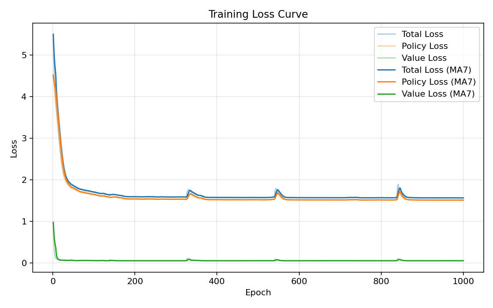

# Pyrga

Lightweight AlphaZero-style pipeline for a custom 4×4 stacking / tower control game: self-play generation, PUCT MCTS (with Dirichlet noise), policy–value network, supervised updates, iterative gating.

## Rules

- Board: 4×4 (16 cells).
- Pieces per player: 5 squares, 5 circles, 5 arrows (arrow direction chosen on placement: up/right/down/left).
- Placement constraints (depend on previous move):
  - Previous was a square at (r,c): next move must go to one of its 4 orthogonal neighbours.
  - Previous was an arrow at (r,c) with direction d: next move must lie anywhere along the ray from (r,c) in direction d (inclusive) until the edge.
  - Previous was a circle at (r,c): next move must (if still legal) be on the same cell.
  - Fallback: if no legal cell under these constraints, you may place on any empty cell (with zero pieces). If none exist the game ends.
- Cell constraints: each cell holds at most 3 pieces; piece types are unique within a cell (≤1 square, ≤1 circle, ≤1 arrow).
- Tower & scoring: when a cell reaches 3 pieces it becomes a tower. Ownership: player with strictly more pieces there (2–1 or 3–0). Final score = number of owned towers. Outcome z ∈ {+1, 0, -1} from the current player’s perspective.
- Action encoding (96 total):
  - 0–15: place square on cell i
  - 16–31: place circle on cell i
  - 32–95: place arrow on cell i; direction = (a−32) % 4 (0 up, 1 right, 2 down, 3 left)

## Result
1st training run (batch size 256, lr 1e-3, 1000 epochs, on random init weights):

2nd training run (batch size 256, lr 1e-3, 1000 epochs, preload tr01_best.pt):

3rd training run (batch size 512, lr 1e-3, 1000 epochs, preload tr02_best.pt):


## Quick
Pipeline: 3-step training loop. Commands are single-line; add or adjust flags (e.g. `--model`, `--mcts-sims`, temperature) as you iterate.

1. Self-play (produce `data/sp.npz` with `(s, π, z)`):
```bash
python -m src.self_play --games 100 --mcts-sims 200 --out data/sp.npz --seed 42
```
Generates trajectories using MCTS (PUCT) per move; visit counts -> policy target; final outcome -> value targets.

2. Train (fit policy & value heads):
```bash
python -m src.train --data data/sp.npz --epochs 1000 --batch-size 512 --save ckpt/tr.pt --log ckpt/tr.log --seed 42
```
Produces `cand.pt` (last) and `cand_best.pt` (lowest loss). Use `--model ckpt/best.pt` to continue from previous best, or tweak AMP / device flags if needed.

3. Arena (gating candidate vs best):
```bash
python -m src.arena --candidate ckpt/tr.pt --best ckpt/best.pt --eval-games 50 --mcts-sims 400 --accept-rate 0.55
```
Deterministic matches (no temperature / noise). Promote candidate if win rate meets threshold. Then loop back to step 1 with the new `best.pt`.

Optional: plot training curve for a sanity check.
```bash
python ckpt/visual.py --log ckpt/train.log --smooth 7 --out curve.png
```
Log format: `epoch N: loss=... policy=... value=... time=...s`.

### Battle (vs AI)
Play against the current model:
```bash
python -m tests.battle --model ckpt/best.pt --mcts-sims 400 --device cuda
```
Controls:
- Mouse: click a cell (highlight)
- Keys: `s` square, `c` circle, `a` arrow (press `a` repeatedly to rotate direction 0→1→2→3)
- Preview: green outline / arrow before confirming
- Enter / Space: place; `q` / `Esc`: quit

Notes: `--mcts-sims` sets AI strength; without `--model` you play a random-initialized net (weak). Lower sims (e.g. 100) for speed; add `--delay` (if present) to slow display.

### Data Format
NPZ file fields:
- `s`: float32 (N, C, 4, 4)
- `p`: float32 (N, 96)
- `z`: float32 (N,)

## Engine

Core learning triple: (s, π, z).

1. Observation: stacked planes (own/opponent occupancy per type, arrow direction one-hot, remaining piece counts, side-to-move).
2. Network (PolicyValueNet): light residual CNN → 96 policy logits + scalar value v ∈ [−1,1].
3. MCTS: PUCT selection Q+U; root Dirichlet noise for exploration; illegal actions masked then renormalised; value signs flipped up the path.
4. Self-Play: run N simulations per move, convert visit counts to π; use temperature sampling for early moves then argmax; game end produces z.
5. Training (train.py): minimise L = CE(policy_logits, π_target) + MSE(v, z); AdamW + optional AMP. Iteration is performed manually: generate new self-play data → train → arena test.
6. Stability: strict legality masking, temperature cooling; (optional) you can maintain a simple replay buffer externally by concatenating past NPZ files before training to reduce distribution shift.

Technical notes / principles:
- PUCT: U ∝ P[a] * sqrt(N_total) / (1 + N[a]) ensuring principled exploration–exploitation tradeoff.
- Dirichlet root noise: prevents premature policy collapse; can be disabled for deterministic evaluation / arena.
- Value sign inversion: propagates evaluation from leaf to root with alternating perspective (zero-sum consistency).
- Manual iteration + gating: user-driven loop (self-play → train → arena) promotes a candidate only if its arena win rate ≥ threshold, preventing regressions without requiring an orchestration script.
- Loss structure: policy cross-entropy + value MSE; clean separation enables later auxiliary heads (e.g. tower ownership) without entangling core optimisation.
- Determinism hooks: unified `--seed` seeds Python / NumPy / Torch; helps reproduce acceptance decisions and debugging runs.
- Mixed precision (AMP): halves memory & speeds math on GPU; automatic fallback keeps CPU path simple.
- Gradient safety: norm clipping + scaler help prevent exploding updates and NaN cascades.
- Illegal action masking: logits for invalid moves removed then renormalised; guarantees π is a valid distribution and stabilises training.
- Data schema: NPZ (`s,p,z`) is minimal yet extensible (extra arrays can be appended without breaking existing loaders).
- Evaluation independence: arena uses deterministic argmax (no temperature / noise) to measure pure policy quality separate from exploration heuristics.
- Extensibility: modular files (rules, search, model, data gen, training, loop) allow swapping individual components (e.g. alternative network or search tweaks) without global refactors.

## Future

Potential extensions (roughly ascending sophistication):
1. 8-fold symmetry augmentation (rotations / reflections).
2. Replay sampling strategies: stochastic or prioritized (PER).
3. Policy regularisation: KL to previous policy or temperature ramps.
4. Auxiliary heads: tower ownership or remaining-move prediction.
5. Search efficiency: root reuse / batched GPU inference / partial tree persistence.
6. Distributed self-play: multi-process or multi-node with parameter server.
7. Advanced search tuning: dynamic c_puct, progressive widening.
8. Evaluation suite: Elo tracking, long-horizon stability, symmetry consistency checks.
9. Network scaling: deeper residual stacks, Squeeze-Excitation / attention, mixed-head designs.
10. Reliability: NaN/Inf watchdog & gradient explosion fuse.

PRs / experiments are welcome.

---
Concise, reproducible, extensible. Have fun. 🧠
